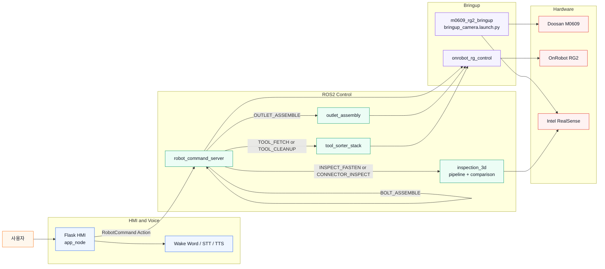
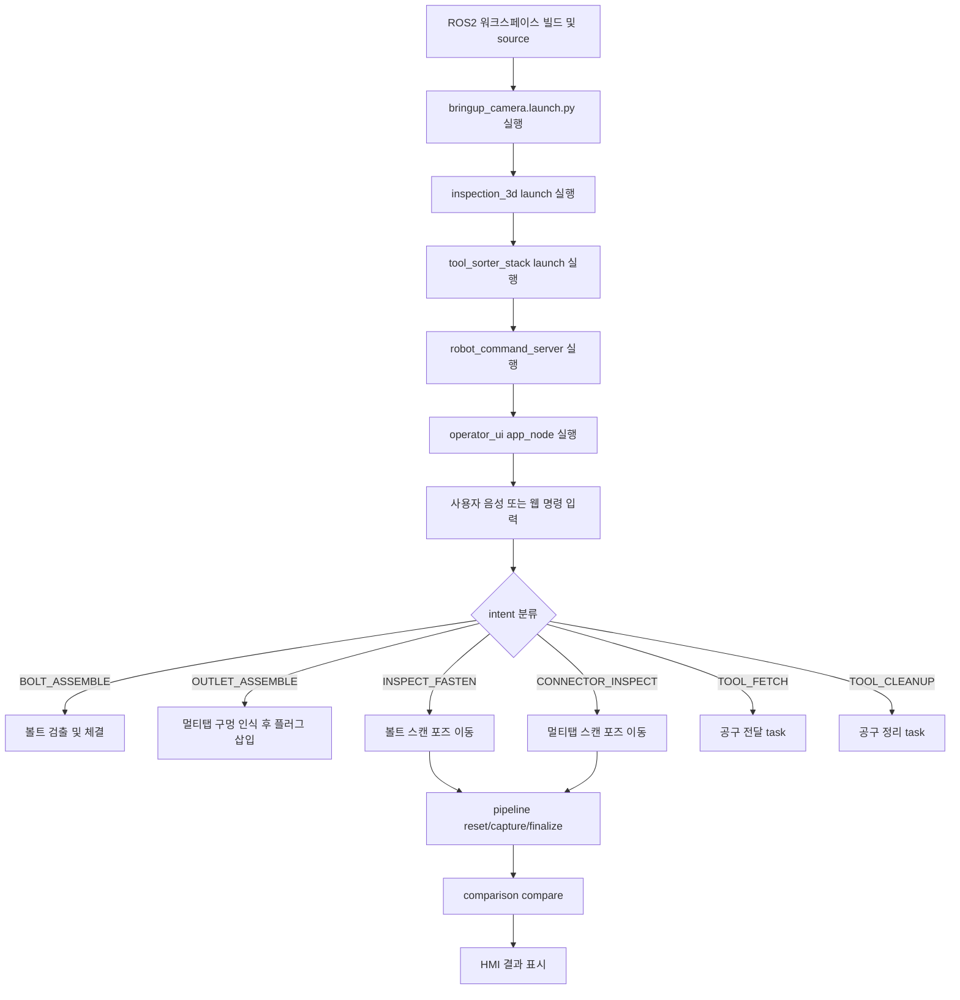
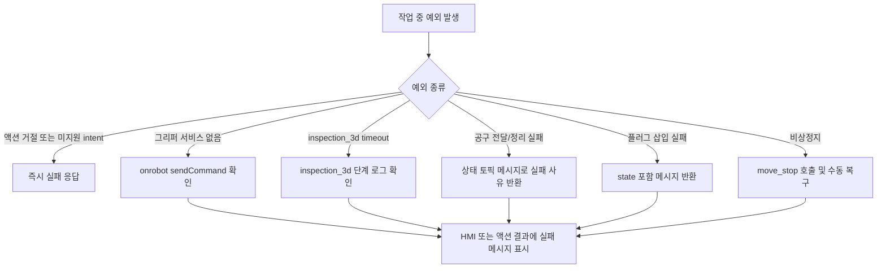
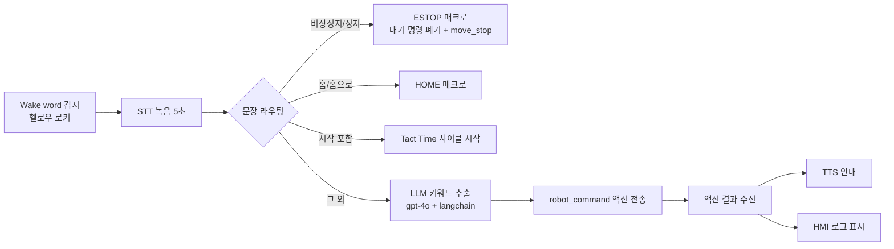

# VAAIS (Vision & Audio-guided Assembly & Inspection System)

**두산 M0609 협동로봇 기반, 비전(Computer Vision)과 음성 인터페이스로 조립·검사·공구관리를 통합 수행하는 ROS2 시스템**


---

## Overview

`VAAIS`는 AI(Computer Vision) 기반 협동로봇 작업 어시스턴트를 구현한 Proof of Concept 수준의 시스템입니다.

* 조립 라인에서는 작업자마다 체결 위치·순서·검사 기준이 미세하게 달라 품질 편차가 발생하기 쉽고, 반복되는 볼트/커넥터 체결과 육안 검사는 피로도를 높입니다.
* 검사 공정은 사람의 육안 판단에 의존하는 경우 기준이 흔들리기 쉬우며, 공구 정리/전달 같은 부가 작업이 본작업 흐름을 방해합니다.

VAAIS는 이 문제를 **음성/웹 명령으로 로봇에 작업을 지시하는 HMI**, **볼트·콘센트(멀티탭) 체결을 수행하는 로봇 제어 계층**, **다중 시점 Pointcloud 캡처·비교로 체결 여부를 판정하는 3D 검사 파이프라인**, **공구를 인식해 전달·정리하는 보조 작업 계층**을 하나의 ROS2 워크스페이스로 통합해 해결합니다.

> 작업자가 wake word로 로봇을 호출하면 STT/LLM이 발화를 intent로 변환하고, `robot_command_server`가 이를 실제 로봇 작업(체결/검사/공구관리)으로 매핑해 실행합니다. 검사 작업은 여러 시점에서 캡처한 Pointcloud를 ICP로 병합한 뒤 기준(reference) PCD와 비교해 합격/불합격을 판정하고, 결과는 HMI와 TTS로 즉시 안내됩니다.

본 시스템은 실제 산업 현장 수준의 안전 인증이나 대량 생산 라인 연동을 목표로 하지 않으며, 비전·음성 통합 협동로봇 조립/검사 워크플로우의 가능성을 검증하는 데모 시스템입니다.

---

## Design Philosophy — Human-in-the-Loop

VAAIS는 완전 자동화가 아니라 **AI/로봇이 1차 판단·작업을 수행하고 사람이 최종 승인·개입하는 반자동화(Human-in-the-Loop) 구조**를 지향합니다. 검사 결과나 애매한 상황(`CLARIFY_NEEDED` 등)에서는 로봇이 스스로 확정 짓지 않고 사람에게 확인을 요청하도록 설계했습니다. 이런 협업 구조가 완전 자동화 대비 갖는 장점은 다음과 같습니다.

### 1. 안전성 및 공정 신뢰성 극대화 (Safety & Reliability)

* **결함 유출 및 사고 예방**: AI 비전 모델이나 3D 검사 알고리즘이 98% 이상의 높은 정확도를 보이더라도, 조명 변화·심한 이물질·특이 케이스 등 현장의 예측 불가능한 변수로 인한 오판 가능성은 항상 존재합니다. 최종 승인을 사람이 담당하면 불량품 유출이나 로봇 돌발 모션으로 인한 위험을 실질적으로 방지할 수 있습니다.
* **법적·책임 소재의 명확성**: 자동차/전자/항공 등 고정밀 부품 분야에서 품질 결함 발생 시 책임 소재를 명확히 할 수 있으며, ISO 등 규제 표준 기준을 충족하기도 더 용이합니다.

### 2. 현장 맞춤형 유연성과 예외 처리 능력 (Flexibility & Edge Case Handling)

* **돌발 변수(Edge Case)에 신속 대응**: 완전 자동화 라인에서는 1~2mm 단차 오차나 처음 보는 변형 부품이 들어오면 전체 라인이 멈춰버립니다. 반자동화 구조는 비전/로봇이 판단하기 애매한 상황에서 사람에게 되물어 조치하도록 유연하게 처리할 수 있습니다.
* **다품종 변종 생산(HMLV) 적응력**: 신제품이 추가되거나 공정이 자주 바뀌는 환경에서, AI 알고리즘을 매번 완벽하게 재학습시키지 않아도 사람의 유연한 판단을 결합해 신속하게 현장에 적용할 수 있습니다.

### 3. 작업자 피로도 감소 및 작업 효율성 향상 (Ergonomics & Efficiency)

* **비부가가치 공수 최소화**: 작업자가 단순 반복적인 조립(볼트 체결, 커넥터 삽입 등)이나 장시간 육안검사를 직접 하지 않고, 로봇이 1차 작업을 완료해놓은 결과만 가볍게 확인/승인하면 되므로 신체적·정신적 피로도가 크게 줄어듭니다.
* **고도화된 작업자로의 전환**: 작업자는 '단순 노동자'에서 로봇을 감독하고 최종 품질을 관리하는 '고숙련 공정 관리자'로 역할이 업그레이드됩니다.

### 4. 구축 및 유지보수 비용 절감 (Cost-Effectiveness)

* **초기 도입 비용 절감**: 99.999% 수준의 완전 자동화를 달성하기 위한 극단적인 기술적 비용(고가의 정밀 전용 툴링, 무수한 특수 예외처리 알고리즘 개발 등)을 줄일 수 있습니다.
* **현장 점진적 적용 가능**: 초기에는 사람의 개입 비중을 높게 유지하다가, 데이터가 쌓이고 AI 신뢰도가 올라감에 따라 승인 단계를 점차 간소화하는 방식으로 단계적 자동화 전환이 가능합니다.

> 💡 **한 줄 요약**: AI와 협동로봇의 빠른 처리 속도 및 고정밀 스캔 능력과, 사람의 뛰어난 상황 판단력 및 예외 처리 능력을 결합함으로써 최소의 구축 비용으로 최고의 공정 신뢰성과 안전성을 확보할 수 있다는 점이 VAAIS가 채택한 반자동화(Human-in-the-Loop) 구조의 핵심 장점입니다.

---

## Key Features

### HMI & Voice — 음성/웹 명령 인터페이스

* `operator_ui/app_v5.py`가 Flask 웹 서버, ROS2 브리지, wake word 감지, STT/TTS를 한 프로세스에서 수행
* Wake word 감지 → OpenAI Whisper 기반 STT → GPT/LangChain 기반 문장 분류(intent 추출) → `robot_command` 액션 전송
* `OPENAI_API_KEY` 미설정 시 웹 HMI는 정상 구동하되 음성 엔진만 비활성화

### Assembly — 볼트/콘센트(멀티탭) 체결

* `BOLT_ASSEMBLE`, `OUTLET_ASSEMBLE` intent를 각각 `robot_control`, `outlet_assembly` 패키지의 task로 매핑
* 체결 전 그리퍼(`/onrobot/sendCommand`) 자동 개방 등 공통 준비 동작 수행

### 3D Inspection — Pointcloud 기반 체결 검사

* `inspection_3d` 패키지가 다중 시점 PointCloud2를 `reset → capture → finalize` 서비스로 누적·병합(ICP)하고 ROI/DBSCAN 필터링 후 저장
* `pointcloud_comparison`이 기준 PCD(`good_bolt.pcd`, `good_multitap.pcd`)와 비교해 검사 결과 산출
* 검사 결과는 HMI에서 바로 조회 가능하도록 `bolt/`, `outlet/`의 `references/captures` 구조로 저장

### Tool Management — 공구 인식/전달/정리

* `tool_sorter_core`의 공구 인식(perception)을 공통으로 사용해 `tool_sorter_handover`(전달), `tool_sorter_cleanup`(정리) task manager가 각각 시퀀스 수행
* `/tool_sorter/handover/*`, `/integration/tool_sorter/*` 서비스·토픽으로 세션 시작/중단 제어

---

## System Architecture



### Workflow Chart



### 예외 처리 플로우



### 서브시스템 구성

| Subsystem | 주요 구성 | 역할 |
| --- | --- | --- |
| HMI & Voice | `operator_ui/app_v5.py` | Flask 웹 서버, wake word/STT/TTS, `robot_command` 액션 클라이언트 |
| Robot Command | `robot_control/robot_command_server` | intent → task 함수 매핑 (상위 제어 진입점) |
| 3D Inspection | `inspection_3d/pointcloud_pipeline`, `pointcloud_comparison` | 다중 시점 Pointcloud 캡처·ICP 병합·기준 비교 |
| Outlet Assembly | `outlet_assembly` | 콘센트/멀티탭 구멍 인식 및 플러그 삽입 |
| Tool Management | `tool_sorter_core`, `tool_sorter_handover`, `tool_sorter_cleanup` | 공구 인식, 전달/정리 시퀀스 |
| Bringup / Driver | `m0609_rg2_bringup`, `onrobot_rg_control` | 로봇/카메라 bringup, RG2 그리퍼 드라이버 |

전체 데이터 흐름: `HMI/Voice(intent 입력)` → `robot_command_server(작업 분배)` → `Assembly / 3D Inspection / Tool Management(실행)` → `HMI(결과 표시)`

---

## Repository Structure

`doosan_rokey_8_project_cobot_2` 저장소 자체는 아래와 같이 ROS2 패키지(`src/`)와
모델 가중치(`ai_models/`), 설정/보조 스크립트(`api/`)로 구성되어 있습니다.

```text
doosan_rokey_8_project_cobot_2/
├── README.md
├── ai_models/                          # 학습된 가중치 (git 추적용 별도 보관)
│   ├── robot_control/resource/         # bolt.pt, D-1.pt (볼트 검출 YOLO 모델)
│   └── tool_sorter_core/models/        # best.pt (공구 인식 모델)
├── api/
│   ├── config/                         # tool_sorter_* 패키지 설정 yaml 사본
│   └── scripts/                        # app_v5.py, stt.py, tts.py (참고/단독 실행용 스크립트)
└── src/
    ├── operator_ui/                    # HMI: Flask + 음성(wake word/STT/TTS) + 액션 클라이언트
    │   ├── operator_ui/app_v5.py       #   메인 엔트리포인트 (app_node)
    │   ├── operator_ui/voice/          #   wake word / STT / TTS 모듈
    │   ├── templates/, static/         #   HMI 웹 페이지
    │   └── pointclouds/{bolt,outlet}/  #   검사 결과 PCD 저장 위치
    ├── robot_control/                  # robot_command_server, 볼트 체결/검사 orchestration
    ├── inspection_3d/                  # Pointcloud 캡처/ICP 병합/비교
    ├── od_msg/                         # inspection_3d 비교 서비스 타입
    ├── voice_interfaces/               # RobotCommand.action, GetKeyword.srv
    ├── outlet_assembly/                # 콘센트/멀티탭 체결 구현체
    ├── tool_sorter_core/                # 공구 인식, 공통 task manager, motion 유틸
    ├── tool_sorter_cleanup/             # 공구 정리 구현체
    └── tool_sorter_handover/            # 공구 전달 구현체
```

### 실제 빌드 워크스페이스 구성

이 저장소는 그 자체로 하나의 colcon 워크스페이스가 아니라 `src/` 아래 패키지 모음이므로,
실제 빌드 시에는 Doosan ROS2 SDK와 OnRobot RG2 드라이버를 별도로 옆에 두고 함께 빌드합니다.

```text
~/cobot_ws/
├── build/ install/ log/
└── src/
    ├── doosan_rokey_8_project_cobot_2/src/   # 본 저장소 (위 9개 패키지)
    ├── rg2/
    │   └── m0609_rg2_bringup/                # 로봇 + RG2 + RealSense bringup
    ├── onrobot-ros2/                          # OnRobot RG2 드라이버 (외부 의존성, 아래 참고)
    │   ├── onrobot_rg_control/
    │   ├── onrobot_rg_msgs/
    │   ├── onrobot_rg_description/
    │   └── _onrobot_rg_modbus_tcp/
    └── doosan-robot2/                         # Doosan ROS2 SDK
        ├── dsr_bringup2/ dsr_common2/ dsr_controller2/
        └── dsr_description2/ dsr_hardware2/ dsr_msgs2/
```

### ROS 2 패키지

| 패키지 | 역할 |
| --- | --- |
| `operator_ui` | Flask HMI, 통합 음성 인식, `robot_command` 액션 클라이언트 (`app_node = operator_ui.app_v5:main`) |
| `robot_control` | 상위 액션 서버, 볼트 체결, 3D 검사 orchestration, 공구 task 중계 |
| `inspection_3d` | 다중 시점 점군 캡처 / ICP 병합 / 비교 (`pipeline_node`, `comparison_node`) |
| `od_msg` | `SrvPointCloudCompare`, `SrvDepthPosition` 서비스 타입 정의 |
| `voice_interfaces` | `RobotCommand.action`, `GetKeyword.srv` 정의 |
| `outlet_assembly` | 콘센트/멀티탭 체결 구현체 (`plug_insert_standalone` 단독 실행 진입점 포함) |
| `tool_sorter_core` | 공구 인식(`perception_node`), TF broadcaster, 공통 task manager 유틸 |
| `tool_sorter_cleanup` | 공구 정리 구현체 (`autonomous_task_manager`) |
| `tool_sorter_handover` | 공구 전달 구현체 (`handover_task_manager`) |
| `m0609_rg2_bringup` (외부) | 로봇 + RG2 + RealSense bringup |
| `onrobot_rg_control` 등 (외부) | OnRobot RG2 드라이버 및 메시지 패키지 |

---

## Custom Interfaces / API

### ROS 2 Action — 로봇 명령

| 액션명 | 타입 | 설명 |
| --- | --- | --- |
| `/dsr01/robot_command` | `voice_interfaces/action/RobotCommand` | HMI/음성 명령을 실제 로봇 작업으로 변환 (`robot_command_server` 제공) |

### ROS 2 Services — 3D Inspection

| 서비스명 | 타입 | 설명 |
| --- | --- | --- |
| `/pointcloud_pipeline/reset` | `std_srvs/srv/Trigger` | 누적 점군 상태 초기화 |
| `/pointcloud_pipeline/capture` | `std_srvs/srv/Trigger` | 현재 PointCloud2를 받아 누적 병합 |
| `/pointcloud_pipeline/finalize` | `std_srvs/srv/Trigger` | ROI/필터링/DBSCAN 후 최종 PCD 저장 |
| `/pointcloud_comparison/compare` | `od_msg/srv/SrvPointCloudCompare` | 기준 PCD와 검사 PCD 비교 |

### ROS 2 Services / Topics — Tool Management

| 인터페이스 | 타입 | 설명 |
| --- | --- | --- |
| `/integration/tool_sorter/organize` | `std_srvs/srv/Trigger` | 공구 정리 시작 |
| `/integration/tool_sorter/stop` | `std_srvs/srv/Trigger` | 공구 정리 중단 |
| `/tool_sorter/handover/start` | `std_srvs/srv/Trigger` | 공구 전달 세션 시작 |
| `/tool_sorter/handover/stop` | `std_srvs/srv/Trigger` | 공구 전달 세션 중단 |
| `/tool_sorter/handover/request` | `std_msgs/msg/String` | 전달할 공구 이름 요청 (키워드 한 낱말) |
| `/tool_sorter/handover/status` | `std_msgs/msg/String` (JSON, transient-local) | 전달 세션 상태 (`WAITING_REQUEST` → `SEARCHING` → `PLANNED` → `WAITING_PULL` → `RELEASING`) |

**공구 전달 요청 키워드** (`tool_sorter_handover/tool_request.py` 화이트리스트, 오탈자는 자모 단위 퍼지 매칭으로 보정)

| 공구 클래스 | 인식되는 표현 |
| --- | --- |
| `hammer` | 망치, 해머, 햄머, hammer |
| `screwdriver` | 드라이버, 스크류드라이버, screwdriver |
| `wrench` | 렌치, 스패너, wrench |
| `monkey_wrench` | 몽키, 몽키렌치, 몽키스패너, monkey wrench |
| `vise` | 바이스, 바이스그립, vise |

> ⚠️ **안전 주의**: 공구 전달(`tool_sorter_handover`)과 공구 정리(`tool_sorter_cleanup`)는 같은 로봇 서비스·TF를
> 공유하므로 **동시에 실행하지 않습니다.** (`tool_sorter_stack.launch.py`가 두 task manager를 안전하게
> 동시 등록하는 방식은 위 System Architecture 절 참고). 전달 시 그리퍼 개방 판정은 절대 힘 값이 아니라
> 정지 상태 기준값 대비 **상승분**으로 이루어지며(자중이 공구마다 달라서), 손이 스치는 정도의 순간적인
> 힘 변화로는 열리지 않도록 연속 샘플 확인(debounce)을 거칩니다.

### ROS 2 Service — Gripper

| 서비스명 | 타입 | 설명 |
| --- | --- | --- |
| `/onrobot/sendCommand` | `onrobot_rg_msgs/srv/SetCommand` | RG2 열기/닫기 명령 (체결/검사/공구 작업 공통 사용) |

> 볼트 체결, 검사 전 개방, 플러그 삽입, 공구 정리/전달 **모두 이 서비스 하나로 그리퍼를 제어**합니다.
> 과거에는 볼트 체결이 `onrobot.py`의 직접 Modbus 연결(`192.168.1.1:502`)을 따로 열어, 공구 정리/전달이
> 쓰는 `onrobot_rg_control` 드라이버와 소켓 소유권이 갈리는 문제가 있었습니다(자세한 내용은 아래
> Key Issues & Resolutions 참고). 지금은 의도적으로 직접 Modbus 폴백을 두지 않아, 이 문제가 재발하지
> 않도록 구조로 막아 두었습니다.

### HMI 내부 ROS2 인터페이스 (`operator_ui/app_v5.py`)

HMI는 `robot_command` 액션 외에도, 대시보드 상태 표시와 수동 제어를 위해 아래 토픽/서비스를 별도로 주고받습니다.

| 인터페이스 | 타입 | 방향 | 설명 |
| --- | --- | --- | --- |
| `/dsr01/joint_states` | `sensor_msgs/JointState` | 구독 | 6축 관절 각도(라디안 → 도 변환, `msg.name` 기준 재정렬 후 사용) |
| `/robot/process_state` | `std_msgs/String` (JSON) | 구독 | 공정 단계·불량 여부 — `is_ng`가 참이면 3D 뷰어 팝업 자동 표시 |
| `/camera/camera/color/image_raw` | `sensor_msgs/Image` | 구독 | 실시간 비전 영상 → `/video_feed` MJPEG 스트림으로 재전달 |
| `/ui/admin_control` | `std_msgs/String` | 발행 | 웹 UI 제어 명령(`ESTOP`, `HOME`, `MOVEJ:[...]`, `RETRY` 등) 원문 재발행 |
| `/ui/emergency_stop` | `std_msgs/Bool` | 발행 | 비상정지 알림용 (실제 정지는 `move_stop` 서비스가 수행) |
| `/dsr01/motion/move_stop` | `dsr_msgs2/srv/MoveStop` | 서비스 호출 | ESTOP 시 `stop_mode=1`(Quick Stop)로 즉시 감속 정지. `dsr_msgs2` 미설치 환경에서는 자동 비활성화 |
| `/voice/pick_place_command` | `std_msgs/String` (JSON) | 발행 | wake word 이후 LLM이 추출한 도구/목적지 (`{"raw_text","tools","targets"}`) |

**HMI 안전 설계 포인트**
- **관절 소프트 리밋**: M0609 실제 가동 범위(J2 ±95°, J3/J5 ±135° 등)를 UI 입력값과 서버 양쪽에서 이중으로 클램프
- **비상정지 이원화**: ESTOP 시 ① 대기 중인 이동 명령 전부 큐에서 폐기 + ② `move_stop` 서비스로 실제 모션 감속 정지 — 하나만 하면 "정지는 갔는데 큐에 있던 다음 이동이 이어서 실행"되는 문제가 생길 수 있어 함께 처리
- **명령 직렬 실행**: 모든 로봇 이동 명령은 큐 + 단일 워커 스레드로 순서대로만 실행되어 동시 다중 요청으로 인한 충돌을 방지

### 사용자 명령 → intent 매핑

| 사용자 명령 | intent | 실제 구현체 |
| --- | --- | --- |
| `볼트 체결해줘` | `BOLT_ASSEMBLE` | `robot_control/bolt_assemble_task.py` |
| `콘센트 체결해줘` / `멀티탭 체결해줘` | `OUTLET_ASSEMBLE` | `outlet_assembly/outlet_assembly/plug_insert_task.py` |
| `볼트 검사해줘` | `INSPECT_FASTEN` | `robot_control/pointcloud_inspector_task.py` |
| `멀티탭 검사해줘` | `CONNECTOR_INSPECT` | `robot_control/pointcloud_inspector_task.py` |
| `망치 가져와줘` | `TOOL_FETCH` | `robot_control/tool_handover_task.py` |
| `공구 정리해줘` | `TOOL_CLEANUP` | `robot_control/tool_cleanup_task.py` |

### 음성 처리 흐름



* wake word 감지 모델: `hello_rokey_8332_32.tflite` (`openwakeword`)
* 마이크 장치는 `MicConfig(device_index=...)` 값을 실제 장치 번호에 맞게 코드에서 직접 수정해야 합니다.
* TTS 재생 중에는 wake word 자기 감지를 막기 위한 플래그(`_speaking`)가 별도로 관리됩니다.

### REST API — HMI (Flask, `operator_ui/app_v5.py`)

| Endpoint | Method | 설명 |
| --- | --- | --- |
| `/`, `/admin/dashboard`, `/admin/viewer3d`, `/admin/control`, `/admin/history` | GET | HMI 화면 (메인 / 대시보드 / 3D 뷰어 / 로봇 제어 / 이력) |
| `/video_feed` | GET | 카메라 스트리밍 (multipart/x-mixed-replace) |
| `/api/robot/status` | GET | 로봇/작업 상태 조회 (조인트, STT 로그, tact time, 양불 카운트 등) |
| `/api/robot/command` | POST | 관리자 제어 명령 전송 |
| `/api/inspection/pointcloud` (구 `/api/inspection/inspection_3d`) | GET | 기준/촬영 PCD의 포인트·색상 데이터 조회 (뷰어 렌더링용) |
| `/api/inspection/references`, `/api/inspection/captures` | GET | 저장된 기준/촬영 PCD 파일 목록 조회 |
| `/api/inspection/latest` | GET | 최근 검사 결과(판정, 일치율, 시각) 조회 |
| `/api/inspection/run` | POST | 저장된 PCD 파일 기반 3D 비교 검사 실행 (로봇 모션 없이 재검사) |
| `/api/history/data` | GET | 검사 이력 최근 100건 조회 (SQLite `inspection_results`) |
| `/api/history/download_csv` | GET | 검사 이력 CSV 다운로드 |

> 검사 이력은 `inspection_results` SQLite 테이블에 적재되며, 볼트/멀티탭(콘센트) 종류·서브 항목 번호·일치율(%)·판정 결과·타임스탬프를 기록합니다.

### Pointcloud 저장 구조

```text
src/cobot2_ws/operator_ui/pointclouds/
├── bolt/
│   ├── references/
│   └── captures/
└── outlet/
    ├── references/
    └── captures/
```

* 볼트 검사 결과: `bolt/captures/` · 멀티탭 검사 결과: `outlet/captures/`
* 기준 PCD: `inspection_3d/resource/good_bolt.pcd`, `inspection_3d/resource/good_multitap.pcd`

---

## Prerequisites

### 하드웨어

* Doosan M0609 협동로봇
* OnRobot RG2 그리퍼
* Intel RealSense 카메라
* 제어용 PC 1대 이상 (로봇 bringup + HMI 실행)

### 소프트웨어 요구사항

* Ubuntu 22.04 LTS, ROS 2 Humble
* Python 3.10
* Doosan Robotics ROS2 패키지 (`dsr_msgs2`, `DSR_ROBOT2`, `DR_init`)
* 커스텀 인터페이스: `voice_interfaces`(`RobotCommand.action`, `GetKeyword.srv`), `od_msg`, `onrobot_rg_msgs`
* Flask, SQLite3
* OpenAI API (Whisper STT/TTS, GPT 기반 intent 분류) — `OPENAI_API_KEY` 필요

### Python 의존성 (`operator_ui/setup.py` 기준)

```bash
pip install --user \
  flask \
  opencv-python \
  python-dotenv \
  pyaudio \
  openwakeword \
  scipy \
  sounddevice \
  numpy \
  openai \
  langchain \
  langchain-openai
```

> 과거 `voice_processing`(Azure STT 기반 레거시 노드)을 계속 사용하려면 `azure-cognitiveservices-speech`를
> 추가로 설치해야 합니다(`extras_require['legacy-azure']`). 그 외 각 ROS2 패키지의 세부 의존성은
> 해당 패키지의 `package.xml`/`setup.py`를 참고해 주세요.

---

## Build

```bash
cd ~/cobot_ws   # 워크스페이스 경로는 환경에 맞게 변경

source /opt/ros/humble/setup.bash

colcon build
source install/setup.bash
```

### HMI 환경변수 설정

`operator_ui app_node`의 음성 기능(wake word, STT, TTS, LLM intent 보조 분류)은
`OPENAI_API_KEY`가 없으면 비활성화됩니다. 다음 경로에 `.env` 파일을 두고 키를 설정합니다.

```text
~/cobot_ws/src/cobot2_ws/operator_ui/resource/.env
```

```env
OPENAI_API_KEY=sk-...
```

* `.env`는 Git에 올리지 않습니다.
* 키가 비어 있으면 HMI 웹 서버는 뜨지만 음성 엔진은 시작되지 않습니다.
* `.env`를 수정한 뒤에는 `ros2 run operator_ui app_node`를 다시 실행해야 합니다.

### 외부 의존성 (OnRobot RG2 드라이버)

`onrobot-ros2`와 `rg2`는 `src/cobot2_ws` 바깥(`~/cobot_ws/src`)에 두는 외부 패키지로 관리합니다.
따라서 본 저장소는 최종 제출본 기준으로 **OnRobot RG2 드라이버 패키지(`onrobot-ros2`)를 포함하지 않을 수 있습니다.**
이 경우 아래 패키지가 별도 워크스페이스/저장소에 설치되어 있어야 합니다.

* `onrobot_rg_control`
* `onrobot_rg_msgs`
* `_onrobot_rg_modbus_tcp`

이 외부 의존성이 없으면 다음 기능은 정상 실행되지 않습니다: 볼트 체결, 콘센트/멀티탭 체결, 공구 가져오기, 공구 정리, 검사 시작 전 그리퍼 자동 개방.
특히 `/onrobot/sendCommand` 서비스가 없으면 RG2 관련 작업은 모두 실패합니다.

---

## Run

로봇 드라이버(Doosan bringup), RealSense, OnRobot RG2 드라이버는 순서대로 먼저 실행되어야 합니다.

### 1. 로봇 / 카메라 / 그리퍼 Bringup

```bash
source /opt/ros/humble/setup.bash
source ~/cobot_ws/install/setup.bash

ros2 launch dsr_bringup2 dsr_bringup2_rviz.launch.py mode:=real host:=192.168.1.100 port:=12345 model:=m0609
ros2 launch realsense2_camera rs_align_depth_launch.py depth_module.depth_profile:=848x480x30 rgb_camera.color_profile:=1280x720x30 initial_reset:=true align_depth.enable:=true enable_rgbd:=true pointcloud.enable:=true
ros2 launch onrobot_rg_control bringup.launch.py
```

### 2. 작업 노드 (검사 / 공구 / 명령 서버)

```bash
ros2 launch inspection_3d pipeline_with_comparison.launch.py
ros2 launch robot_control tool_sorter_stack.launch.py
ros2 run robot_control robot_command_server
```

### 3. HMI (Flask + 음성)

```bash
ros2 run operator_ui app_node
```

실행 후 웹 브라우저에서 HMI 화면에 접속하거나 wake word로 음성 명령을 내려 통합 시나리오
(볼트/콘센트 체결 → 3D 검사 → 공구 전달/정리)를 확인합니다.

### 기능별 필요한 구성

| 기능 | 필요한 구성 |
| --- | --- |
| 볼트 체결 | Bringup(로봇/카메라/그리퍼) + `robot_command_server` + `operator_ui` |
| 콘센트/멀티탭 체결 | Bringup(로봇/카메라/그리퍼) + `robot_command_server` + `operator_ui` |
| 볼트/멀티탭 3D 검사 | 위 구성 + `inspection_3d` |
| 공구 가져오기/정리 | 위 구성 + `tool_sorter_stack` |

### 레거시 음성 경로

현재는 `operator_ui app_node`(`app_v5.py`)가 wake word/STT/TTS를 모두 포함하므로 필수가 아닙니다.
다만 과거 `/get_keyword` 서비스 기반 경로를 함께 띄워야 하면 아래 launch를 사용할 수 있습니다.

```bash
ros2 launch robot_control voice_command_stack.launch.py
```

이 launch는 `robot_command_server`와 `voice_command_dispatcher`를 함께 띄웁니다.
(`robot_command_server`만 단독 실행할 때는 `ros2 run robot_control robot_command_server`)

`operator_ui`의 `setup.py`에는 이 외에도 참고/수동 디버깅용 진입점(`legacy_stt`, `legacy_get_keyword`)과
Azure STT 기반 레거시 노드를 위한 `legacy-azure` extra가 정의되어 있으나, 기본 실행 흐름에는 포함되지 않습니다.

### 콘센트/멀티탭 체결 단독 실행 (outlet_assembly)

`OUTLET_ASSEMBLE` intent 없이 플러그 삽입만 단독으로 테스트하려면 아래 방법을 사용할 수 있습니다.

```bash
ros2 launch outlet_assembly plug_insert.launch.py
# 또는
ros2 run outlet_assembly plug_insert_standalone
```

---

## Key Issues & Resolutions

> 아래는 코드 주석과 패키지별 README/가이드 문서에서 실제로 확인한 이슈/원인/해결 내역입니다.
> (커밋 로그가 전부 "Add files via upload"라 히스토리 추적은 어려워, 소스 내 설명 주석을 근거로 정리했습니다.)

| 이슈 | 원인 | 해결 |
| --- | --- | --- |
| 그리퍼(RG2) Modbus 소켓 이중 소유 충돌 | 볼트 체결은 `onrobot.py`로 Compute Box에 직접 Modbus 접속, 공구 정리/전달은 `onrobot_rg_control` 드라이버 서비스 사용 — 한 세션에서 볼트 작업 후 공구 작업(또는 반대)을 실행하면 소켓 소유자가 갈려 실패 | 모든 그리퍼 제어를 `onrobot_rg_control` 드라이버의 `/onrobot/sendCommand` 서비스 하나로 통일 (`gripper_service.py`). 직접 Modbus 폴백은 문제 재발을 막기 위해 의도적으로 제거 |
| 3D 검사 일치율 계산 시 단위 불일치 | PCD 좌표는 m 단위인데 `threshold_mm`(mm 단위)와 그대로 비교 | `compare_pointclouds()`에서 거리 계산 후 `* 1000.0`으로 mm 변환 후 비교하도록 수정 |
| TTS 안내 중 wake word 자기 인식 | 스피커로 재생되는 TTS 음성을 마이크가 다시 wake word로 인식할 위험 | `VoiceEngine.speak()`가 재생 중/직후 유예시간 동안 `_speaking` 플래그를 세워 자기 감지를 차단 |
| 검사 결과 DB 이중 기록 위험 | `robot_command` 경로(스캔 직후 1차 결과)와 웹 UI "검사 시작" 버튼 경로(공식 재검사) 둘 다 `inspection_results`에 기록될 수 있는 구조 | 공식 판정·DB 기록은 웹 UI 트리거 경로(`_run_pointcloud_comparison_and_report`)에서만 수행하도록 원칙을 고정하고, `robot_command` 경로의 1차 결과는 로그/음성 안내용으로만 사용(미기록) |
| Pointcloud 저장 경로가 빌드 방식에 따라 어긋남 | 이전에는 `MODULE_DIR` 기준 상대경로로 파일을 복사했는데, colcon `install` 빌드 방식에 따라 경로가 어긋날 수 있었음 | `robot_control`(`pointcloud_inspector_task.py`) 쪽에서 고정 절대경로로 직접 저장하도록 변경, HMI는 재복사하지 않음 |
| 공구 정리/전달 완료 오판 (transient-local 상태 토픽) | 세션 시작 직후 완료를 기다리면, 직전 작업의 `COMPLETE` 상태가 아직 latch되어 있어 이번 작업의 완료로 오인할 수 있음 | 시작 요청 후 "실제로 바빠지는 것"(상태 전이)을 먼저 확인한 뒤에만 완료 대기를 시작하도록 구현 |
| 공구 전달 4단계(파지 확인) 생략 시 오판 | `WAITING_REQUEST` 상태에서 요청을 보낸 직후 바로 완료를 확인하면, "아직 시작도 안 한 대기 상태"를 종료로 오인 | `tool_handover_task.py`가 파지 완료(요청 상태 이탈)까지 확인한 뒤에만 최종 결과를 판정하도록 순서 고정 |
| 그리퍼 개방 오탐 (공구 전달) | 절대 힘 기준으로 판정하면 공구마다 다른 자중 때문에 오탐 발생 가능 | 전달 자세 도착 직후 정지 상태 힘을 기준값으로 측정하고, **기준값 대비 상승분**으로만 당김을 판정 + 연속 샘플(debounce) 확인 |

> ⚠️ **미검증 항목**: `robot_control/INTEGRATION_GUIDE.md`는 "RG2의 Modbus TCP 서버가 동시 접속 자체를 거부한다"는
> 가정을 실기로 확인하지 않았다고 명시하고 있습니다. 위 그리퍼 통합 해결책은 이 가정을 전제로 설계되었습니다.

---

## Roadmap / TODO

실 산업 배치를 목표로 안전성·검사 정확도 검증이 진행 중이며, 아래 항목은 현재 파악된 개선 방향입니다.

* [ ] **(우선)** SafetyMonitor → SafetyPolicy → RecipeExecutor 계층 구조 적용을 통한 안전 정책 고도화
* [ ] 비상정지/복구 플로우에 대한 실기체 반복 테스트 및 예외 케이스 보완
* [ ] 3D 검사(ICP 병합, 기준 비교) 오탐지·미탐지 케이스 분석 및 threshold 재조정
* [ ] 다양한 조명/배치 조건에서의 Pointcloud 캡처 안정성 검증
* [ ] Wake word 오탐지율 개선 및 소음 환경 대응
* [ ] intent 분류 정확도 향상 (LangChain/GPT 프롬프트 튜닝)
* [ ] `app_v5.py` 이후 버전에 대한 회귀 테스트 체계 마련
* [ ] 배포 자동화 및 로그/모니터링 체계 정비

---

## Documentation

패키지별로 더 자세한 설계/실행 문서가 저장소 안에 이미 있습니다.

| 경로 | 내용 |
| --- | --- |
| `src/operator_ui/README.md` | HMI 시스템 구성, ROS2 토픽 상세, Flask REST API, 안전 설계, 음성 파이프라인 |
| `src/outlet_assembly/README.md` | 콘센트/멀티탭 체결 인식 모델, 상태 머신, 그리퍼 통합 배경, 알려진 제약 |
| `src/robot_control/INTEGRATION_GUIDE.md` | intent 라우팅 규칙, 그리퍼 소유권 충돌 배경, 공구 전달/정리 통합 방법 |
| `src/tool_sorter_core/README.md` | 공구 인식/파지 파이프라인 상세 설계, 실행 순서, 실물 검증 체크리스트 |
| `src/tool_sorter_handover/README.md` | 공구 전달 상태 머신, 관측 자세 설계 근거, 힘 기반 전달 판정 로직 |

> `tool_sorter_core/README.md`는 `docs/` 하위에 포트폴리오용 보충 설명 문서(좌표 변환, YOLO Segmentation,
> 그리퍼 파지 방향 등)를 참조하고 있으나, 이 저장소에는 해당 `docs/` 폴더가 포함되어 있지 않습니다.

---

<div align="center">

본 프로젝트는 Doosan Robotics ROKEY 지능형 로보틱스 엔지니어 과정에서 수행되었습니다.

</div>
